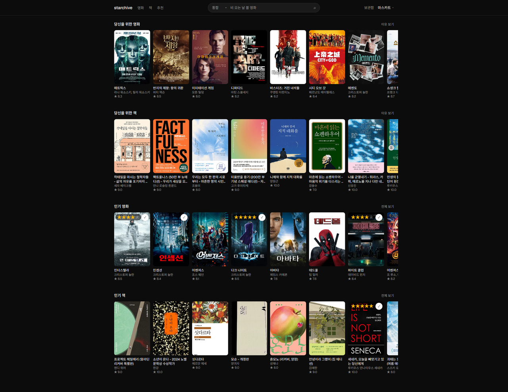
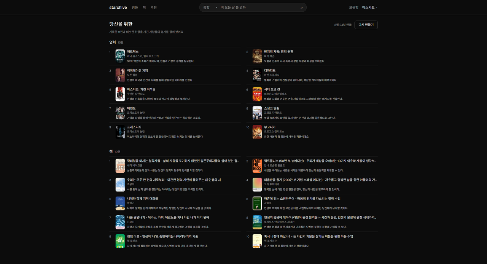
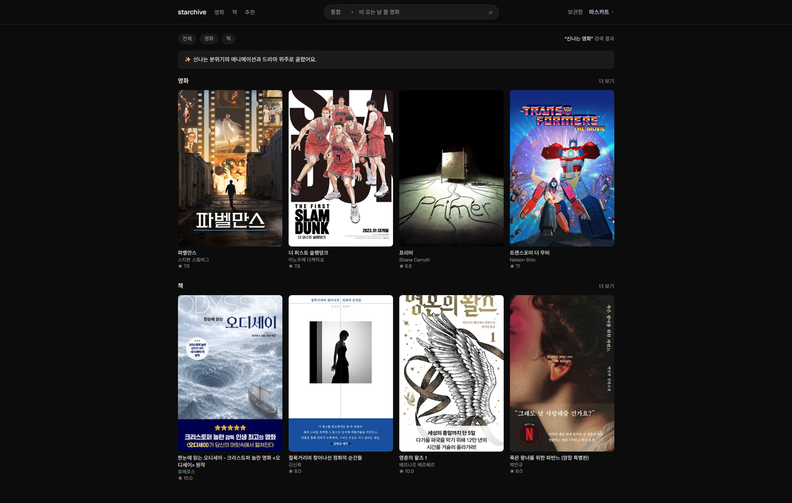

# starchive

영화와 책을 찾고, 기록하고, 추천받는 서비스
측정으로 만든 추천, 의미로 찾는 검색

[](https://github.com/musqat/starchive/actions/workflows/ci.yml)

**[starchive-front.vercel.app](https://starchive-front.vercel.app)**



로컬 실행·수집·배포는 [개발 문서](docs/DEVELOPMENT.md). 상수를 재보며 뒤집은 기록은
[시행착오](docs/trial-and-error.md), 설계대로 안 돌아간 것은 [문제 해결](docs/problem-solving.md).

<br>

## 데이터

영화는 TMDB, 책은 알라딘에서 모아 한 테이블에 담았다. 매체가 달라도 같은 방식으로
찾고, 거르고, 기록한다.

| | 수집 기준 | 건수 |
|---|---|---|
| 영화 | MovieLens 상위 3,000편 + 2018년 이후 500표 이상 | 4,894 |
| 책 | 알라딘 국내도서 베스트셀러 (만화 제외) | 721 |

줄거리가 있는 것은 `text-embedding-3-small` 로 임베딩해 `vector(1536)` 에 담는다.
제목·장르·작가를 줄거리 앞에 붙여 넣는다 — 알라딘 책소개는 홍보 문구가 섞여 있어
줄거리만 넣으면 내용이 묻힌다.

<br>

## 추천

영화와 책을 따로 낸다. 같은 눈금으로 겨룰 이유가 없어서다.

```
평점 3.0 이상 기록  →  취향 중심 (임베딩 평균)
                        ↓
            내용 점수   줄거리가 취향 중심과 가까운 것
            이웃 점수   나와 겹치는 사람들이 좋아한 것 (자카드 ÷ 좋아요 수)
                        ↓
                    후보 30개
                        ↓
            한 시리즈에서 한 편까지만
                        ↓
            gpt-4o-mini 재랭킹  →  10개 + 이유 한 문장
                        ↓
            그중 1칸은 신작 (최근 2년)
```

<details>
<summary>추천 화면 보기</summary>



</details>

**두 점수의 비중이 매체마다 다르다.** 영화는 이웃 점수만 쓴다 — 내용 점수는 자기 힘으로
한 편도 못 올리고 이웃 점수가 뽑은 것의 순서만 흔들어 정확도를 깎았다. 책은 반대로
내용 점수만 돈다. 시드가 MovieLens 라 도서 평점이 없어 이웃 점수가 전부 0이다.

이웃 점수는 좋아요 수로 나눈다. 안 나누면 점수 순서가 인기 순서와 83.5% 일치한다 — 모두가
좋아하는 작품으로는 취향이 갈리지 않고, 남들 안 보는 작품을 겹쳐 좋아할 때 갈린다.

시리즈는 TMDB 컬렉션으로 판단한다. 제목을 맞추면 `킹덤` 과 `킹덤 오브 헤븐` 이 묶이고,
반대로 `에이리언` 과 `프로메테우스` 는 못 묶는다.

배치로 만들어 저장하고 화면은 저장된 것만 읽는다. 하루 한 번 갱신하고
사용자가 직접 다시 만들 수도 있다(쿨다운 60분). 재랭킹이 실패하면 점수순으로 채우고
이유는 템플릿 문장을 쓴다.

### 측정

시드 610명(MovieLens 평점 86,666건)으로 잰다. 한 사람이 좋아한 영화 중 20% 를 안 본
것처럼 숨기고, 추천이 그 영화를 다시 찾아오는지 본다. 같은 조건에서 인기순도 나란히
재 비교 기준으로 쓴다.

| | Recall@10 | NDCG@10 |
|---|---|---|
| 추천 | 0.173 | 0.328 |
| 인기순 | 0.088 | 0.188 |

- `Recall@10` — 숨긴 영화가 추천 10편 안에 몇 개나 들어왔나
- `NDCG@10` — 들어왔다면 몇 번째 칸이었나. 첫 칸에 있으면 열 번째 칸보다 점수가 높다

인기순의 1.97배다.

후보 30개를 뽑는 단계까지의 값이다. 뒤의 재랭킹은 Recall 을 안 바꾸고 커버리지만
넓힌다 — [시행착오](docs/trial-and-error.md#지표-하나로-판단하면-안-되는-사례).

200명에게 10개씩 낸 2,000자리에 서로 다른 작품이 438편 나온다. 상위 10편이 그중 13.1%.

실사용자는 아직 둘이다. 위 수치는 전부 MovieLens 시드로 잰 것이고, 실사용자 기록이
쌓이면 그때 다시 잰다.

**책은 이 표에 안 들어간다.** 시드가 MovieLens 라 도서 평점이 0건이고, 공개 데이터셋도
한국 베스트셀러와 겹치지 않아 정답을 만들 수 없다. 대신 무엇이 나가는지는 쟀다 —
가상 사용자 105명에게 장르별 취향을 주니 일곱 장르가 서로 다른 책을 받았고, 커버리지는
708권 중 248권으로 영화보다 넓다.

**기록이 쌓일수록 잘 맞는다.** 인기순 대비 배율로 보면 7편에서 뒤집힌다.

```
기록    2편   3편   4편   5편   7편   10편
배율   0.34  0.50  0.76  0.83  1.06  1.26
```

기록이 적으면 이웃 판정에 걸리는 사람이 많아 결과가 인기순으로 수렴한다. 한 장르만
5편 넣어 보면 열 자리 중 다섯이 전체 인기순과 겹쳤다. 이웃 조건을 올려 막아 보려
했지만 개인화는 안 늘고 전체 지표만 갈렸다.

그래서 추천은 5편부터 열고, 화면이 "기록이 적어 인기작이 섞인다" 고 알린다. 못 이기는
구간을 감추는 대신 어디쯤인지 말하는 쪽을 골랐다.

신작 1칸은 이 측정에 안 들어간다. 시드 평점이 없어 채점되지 않는다.

여기 상수들은 일반적인 기준으로 정하고 재보며 열 번 넘게 뒤집혔다 — [아래](#만들며-겪은-것) 참고.

<br>

## 검색

제목·감독·배우로도, 분위기로도 찾는다. 한 검색창에서 둘을 합친다.

```
검색어  →  제목·감독·배우 정확 매칭 (SQL)   위에
           분위기·내용 의미 검색 (벡터)      아래
```

| 검색어 | 잡는 쪽 |
|---|---|
| 인터스텔라 | 제목 |
| 크리스토퍼 놀란 | 감독 |
| 키아누 리브스 | 배우 |
| 비 오는 날 볼 잔잔한 영화 | 벡터 |

벡터는 의미가 가까운 걸 찾지 글자를 못 맞춘다. "인터스텔라" 를 쳐도 1등이 아니고
"놀란" 같은 이름은 못 찾는다. 그래서 정확 매칭을 함께 쓴다.

정확 매칭이 잡히면 그 아래 이웃은 검색어가 아니라 잡힌 작품의 임베딩으로 찾는다. 검색어
"인터스텔라" 를 임베딩하면 글자가 닮은 인터내셔널·인스티게이터가 오고, 작품 임베딩이면
그래비티·애드 아스트라가 온다. 이 경로는 OpenAI 를 안 부른다.

**자연어 질의면 결과를 다시 LLM 에 넣어 한 줄을 붙인다(RAG).** "비 오는 날 볼 영화" 에는
`잔잔한 로맨스와 드라마 위주로 골랐어요` 가 뜬다. 제목·이름으로 찾을 때는 안 붙인다.

<details>
<summary>검색 화면 보기</summary>



</details>

영화 줄거리는 사건 나열이라 분위기 질의와 안 맞아, 임베딩에 분위기 문장을 얹어 색인한다.

벡터 검색은 인덱스 없이 4,789편을 전건 스캔한다. 65ms 라 임베딩 API 왕복(392ms)에 묻힌다.
자연어 질의 한 번이 코멘트 생성까지 p50 1.7초, 제목 질의는 임베딩 없이 104ms 다.
카탈로그가 수만 건이 되면 `hnsw` 를 얹고 재현율을 같이 잰다.

<br>

## 구조

```
starchive/
├── backend/    FastAPI · SQLAlchemy · Alembic
│   ├── app/
│   │   ├── core/          설정, DB 엔진, 외부 API 클라이언트
│   │   ├── domains/       도메인별 모델·스키마·라우터
│   │   └── ingestion/     수집 정규화
│   └── scripts/           수집 실행 스크립트
└── web/        Next.js 16 · Tailwind 4
    ├── e2e/           Playwright
    └── src/
        ├── app/           라우트
        ├── components/    UI
        └── lib/           타입, API 클라이언트
```

**DB** — Supabase(Postgres + pgvector). 개발은 `backend/docker-compose.yml` 의 로컬 컨테이너로 한다

**한 테이블** — 영화·책·웹툰을 `contents` 하나에 담고 `type` 으로 구분한다. 매체별
고유 필드는 `content_metadata`(JSONB). 사용자 기록이 FK 하나로 연결된다.

**같은 출처** — 브라우저는 `/api` 로만 요청하고 `next.config.ts` 의 rewrite 가 백엔드로
넘긴다. 인증 쿠키가 프론트 도메인에 저장돼야 서버 컴포넌트가 `cookies()` 로 읽는다.

**운영** — Vercel 프로젝트 둘(API·웹)과 Supabase. `/health` 가 DB 까지 확인하고, 외부 크론이
5분마다 프론트 홈을 호출해 실패하면 메일로 알린다. 홈이 서버에서 목록을 불러오므로 백엔드나
DB 가 죽어도 잡힌다.

<br>

## 테스트

백엔드 **156 개**, E2E **46 개**.

| 영역 | 테스트 |
|---|---|
| 인증·기록·메모 | 59 |
| 추천 파이프라인 | 49 |
| 목록·검색 | 30 |
| 수집 정규화 | 14 |
| 헬스·보안 헤더 | 4 |
| E2E (Playwright) | 46 |

CI 는 PR 마다 `pytest` · 배포 의존성 검증 · `typecheck` · `lint` 를 돌린다.

<details>
<summary><b>CI 범위와 이유</b></summary>

<br>

DB 가 필요한 테스트는 `db` 표시로 갈라 두고, CI 는 컨테이너 없이 도는 42 개만 돌린다.
나머지는 로컬에서 `docker compose up -d` 뒤에 돈다.

E2E 도 CI 에 안 넣었다. 첫 화면이 "인기 영화" 캐러셀이라 카탈로그가 채워진 DB 가 필요한데,
CI 에서 그걸 만드는 길이 둘 다 걸린다. 수집 API 키를 넣으면 외부가 흔들릴 때 머지가 막히고,
덤프를 저장소에 두면 임베딩까지 들어가 저장소가 커진다.

**배포 의존성 검증**은 사고를 겪고 넣었다. 수집 전용 그룹에 있던 재시도 라이브러리를
재랭킹이 런타임으로 끌어들여, 로컬 테스트가 전부 통과한 채로 배포만 죽었다.

```bash
uv run --no-dev --no-group etl python -c "from app.main import app"
```

</details>

실행 방법은 [개발 문서](docs/DEVELOPMENT.md#테스트).

<br>

## 만들며 겪은 것

이 프로젝트에서 가장 값이 컸던 부분

- [시행착오](docs/trial-and-error.md) — 일반적인 기준으로 정한 상수·방향을 재보니 열 번 넘게 틀렸다. 무엇을 믿었고 무엇으로 갈렸는지
- [문제 해결](docs/problem-solving.md) — 설계대로 안 돌아간 것을 문제 → 원인 → 해결
